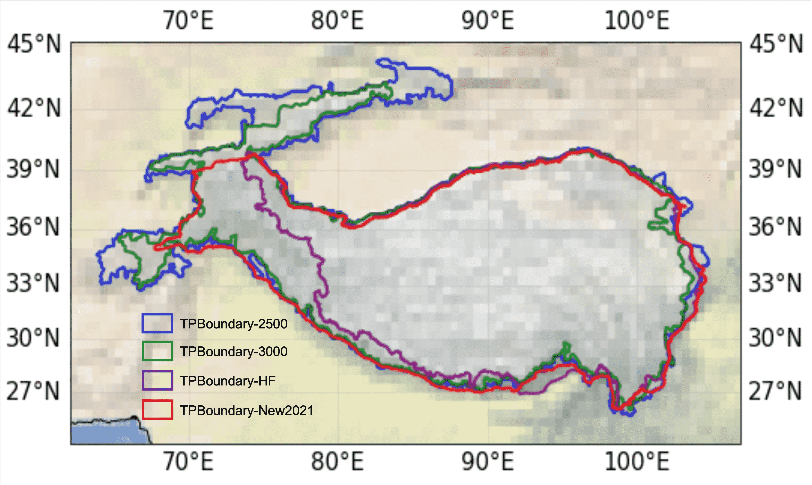
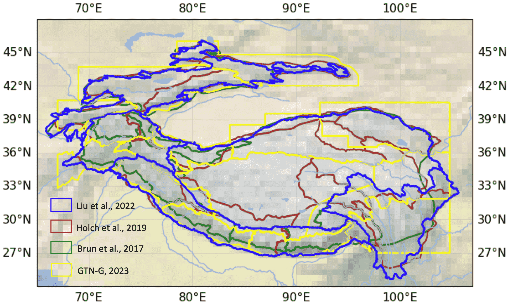
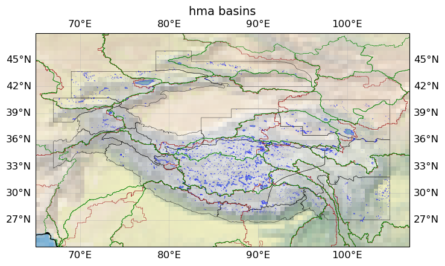
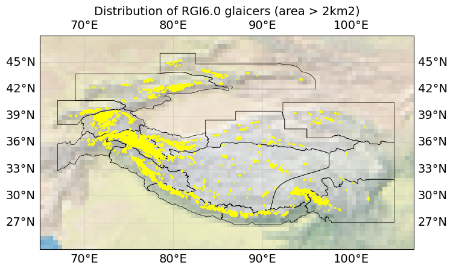
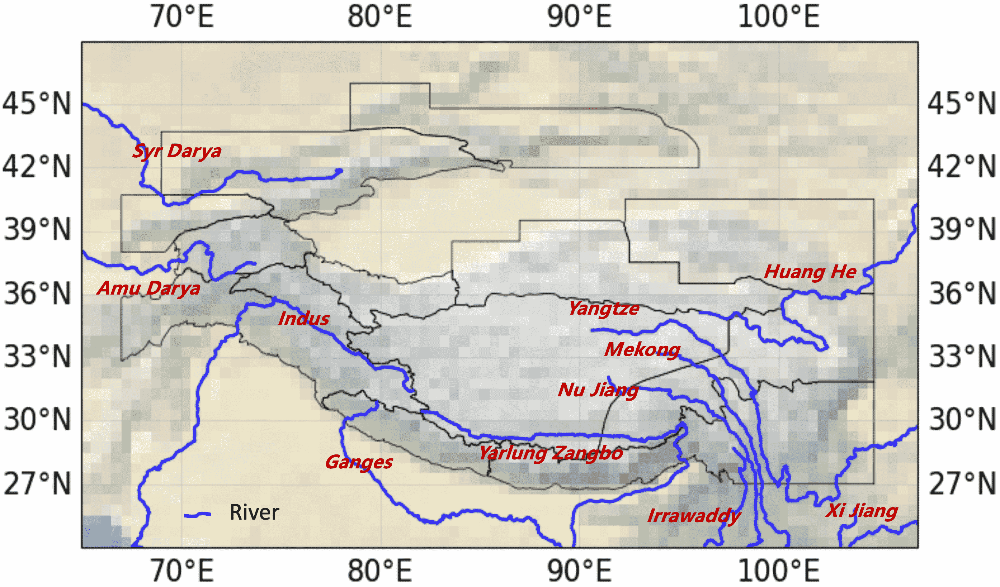
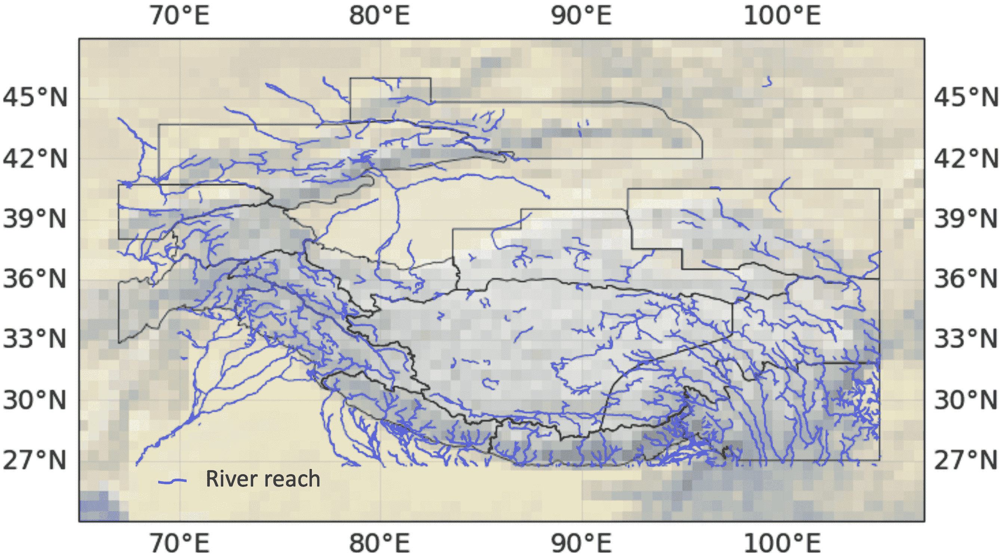
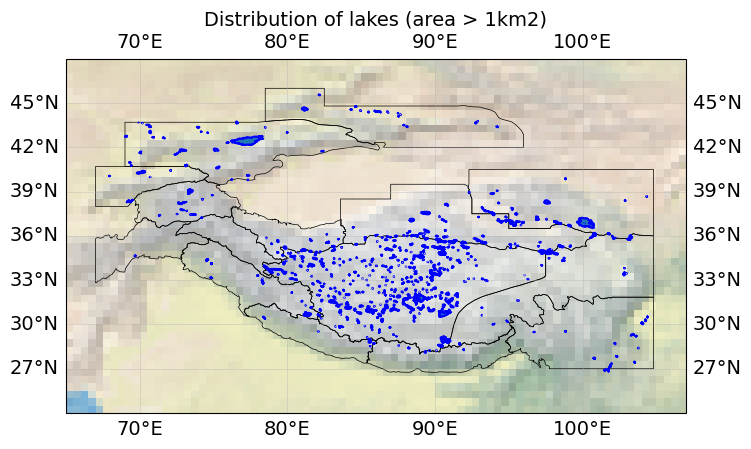

# High-Moutain-Asia-GIS-data
Including extents of the High-Mountain Asia region and the  sub-resions, as well as the main rivers, lakes and glaciers vector data in this region.

## - 1. Extents:
### -- 1.1. Tibet extents  
TPBoundary_2500, TPBoundary_3000, TPBoundary_HF and TPBoundary_ New.
References:
1. Zhang, Y., Ren, H., Pan, X. (2019). Integration dataset of Tibet Plateau boundary. National Tibetan Plateau Data Center, DOI: 10.11888/Geogra.tpdc.270099. CSTR: 18406.11.Geogra.tpdc.270099. (Data citation)
2. Zhang, Y.L., Li, B.Y., Zheng, D. (2002). A discussion on the boundary and area of the tibetan plateau in china. Geographical Research.
3. Zhang, Y.L., Li, B.Y., Liu, L.S., Zheng, D. (2021). Redetermine the region and boundaries of Tibetan Plateau. GEOGRAPHICAL RESEARCH, 40(6), 1543-1553.   

### -- 1.2. HMA extents (with glacier subregions)  
1) Overview of the HMA extents in different researches.

#### --- 1.2.1. hma_subregions_brun2017:
References:
1) Brun F, Berthier E, Wagnon P, et al. A spatially resolved estimate of High Mountain Asia glacier mass balances from 2000 to 2016[J]. Nature geoscience, 2017, 10(9): 668-673.
#### --- 1.2.2. hma_subregions_bolch2019:   
References:
1) Bolch T, Shea J M, Liu S, et al. Status and change of the cryosphere in the extended Hindu Kush Himalaya region[M]. The Hindu Kush Himalaya Assessment. Springer, Cham, 2019: 209-255.   
#### --- 1.2.3. hma_subregions_gtng_2023:
References:
1) GTN-G. GTN-G Glacier Regions. 2023. doi:10.5904/gtng-glacreg-2023-07.   

#### --- 1.2.4. Pan-Tibetan Highlands (hma) extents 
(Comprising 4 subregions: Tibetan Plateau, Himalaya, Hengduan Mountains and Mountains of Centra Asia)   
References:
1. Liu J, Milne R I, Zhu G F, et al. Name and scale matters: Clarifying the geography of Tibetan Plateau and adjacent mountain regions[J]. Global and Planetary Change, 2022: 103893.

## - 2. Basins:
### -- 2.1. Hydrologic basin  with 6 min spatial resolution on Asia.
References:
1. Vörösmarty, C. J., McIntyre, P. B., Gessner, M. O., Dudgeon, D., Prusevich, A., Green, P., et al. (2010). Global threats to human water security and river biodiversity. Nature 467, 555–561. doi: 10.1038/nature09440  
2. Shean D E, Bhushan S, Montesano P, et al. A systematic, regional assessment of high mountain Asia glacier mass balance[J]. Frontiers in Earth Science, 2020, 7: 363.   
### -- 2.2. Hydrologic basins from level1-level6 by Lehner and Grill (2013).
Reference: 
1. Lehner, B., Grill G. (2013). Global river hydrography and network routing: baseline data and new approaches to study the world’s large river systems. Hydrological Processes, 27(15): 2171–2186.

## - 3. Glaciers  
RGI60_13(Central Asia); RGI60_14(South Asia(West)); RGI60_15(South Asia(East)). 
References:
1. RGI Consortium (2017). Randolph Glacier Inventory – A Dataset of Global Glacier Outlines: Version 6.0: Technical Report. Technical report, Global Land Ice Measurements from Space. doi: 10.7265/N5-RGI-60.

## - 4. Rivers  
### -- 2.1. GRWL dataset
Major rivers in HMA
References:
1. download from: https://datacatalog.worldbank.org/search/dataset/0042032

### -- 2.2. sword dataset
River beaches in HMA
References:
1. Altenau E H, Pavelsky T M, Durand M T, et al. The Surface Water and Ocean Topography (SWOT) Mission River Database (SWORD): A global river network for satellite data products[J]. Water Resources Research, 2021, 57(7): e2021WR030054.

## - 5. Lakes  
Global Lakes and Wetlands Database Level-1 (GLWD-1) Dataset.
References
1. Lehner, B. and Döll, P. (2004): Development and validation of a global database of lakes, reservoirs and wetlands. Journal of Hydrology 296/1-4: 1-22.  

